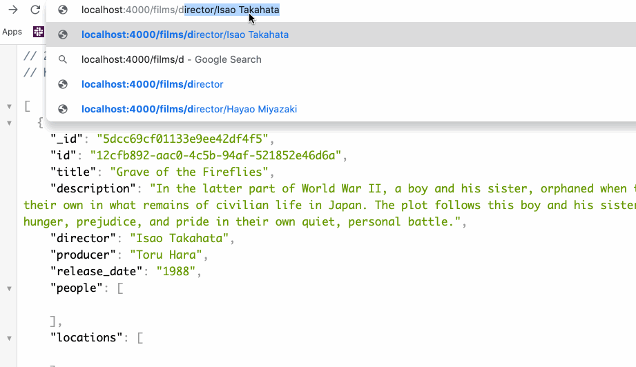

  
# Studio Ghibli API  
The __Studio Ghibli API__ documents information about the films from Studio Ghibli and information about the characters and locations within the films.  

## Getting Started  

1. Clone the repo
2. Run `npm install`
3. Start a `mongod` server 
4. Run `npm run seed` to seed the data
5. Run `npm run dev` to open a connection to the database

REST routes for the Film model:

| URL                  | Path                    | Method   | Action  | Description                                 |
| -------------------- | ----------------------- | -------- | ------- | ------------------------------------------- |
| `/films`             | `/`                     | `GET`    | #index  | List of all Films                           |
| `/films/`            | `/films/:id`            | `GET`    | #show   | Displays a single Film by id                |
| `/films/director`    | `/director/:director`   | `GET`    | #show   | Lists all films by a specific director      | 
| `/films/delete`      | `/films/delete/:id`     | `DELETE` | #delete | Removes a film from the database by id      |
  

REST routes for the People model:

| URL                  | Path                    | Method   | Action  | Description                                 |
| -------------------- | ----------------------- | -------- | ------- | ------------------------------------------- |
| `/people`            | `/people`               | `GET`    | #index  | List of all People                          |
| `/people/`           | `/people/:id`           | `GET`    | #show   | Display a single person by id               |
| `/people/create`     | `/people/create`        | `POST`   | #create | Creates a new person                        |
| `/people/update`     | `/people/update/:id`    | `PUT`    | #update | Updates an existing persons data            |
| `/people/delete`     | `/people/delete/:id`    | `DELETE` | #delete | Removes a person from the database by id    |  

REST routes for the Locations model:

| URL                  | Path                    | Method   | Action  | Description                                 |
| -------------------- | ----------------------- | -------- | ------- | ------------------------------------------- |
| `/locations`         | `/locations`            | `GET`    | #index  | List of all Locations                       |
| `/locations`         | `/locations/:id`        | `GET`    | #index  | List a specific location by id              |  

  

### Technologies Used  
Javascript, MongoDB, Mongoose, Express.js, Node.js, Heroku.  
  
  
  
- _Dataset from https://ghibliapi.herokuapp.com/_ 
- _README banner image from http://www.fanpop.com/_
